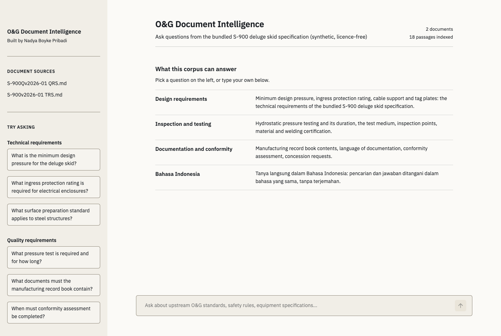
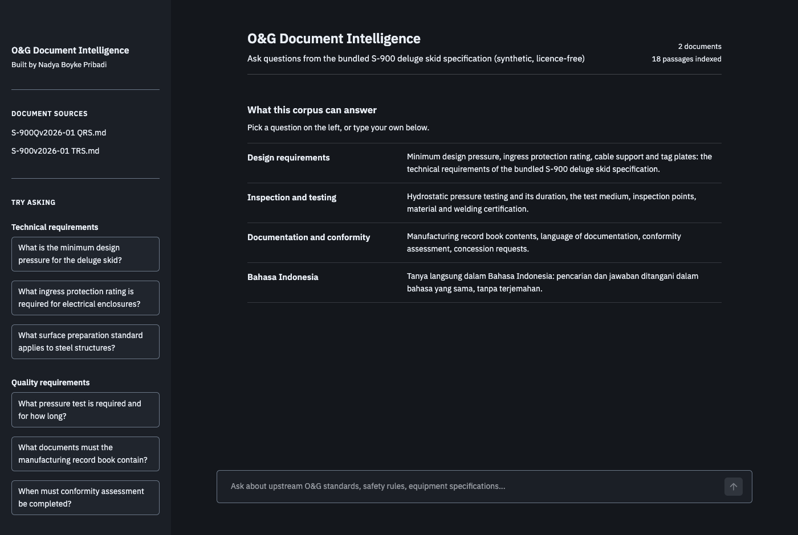

# Upstream O&G AI Portfolio

Three working AI demos for upstream oil and gas operations.
Built by **Nadya Boyke Pribadi**.

[](https://linkedin.com/in/nadya-nadya-404309104)
[](https://github.com/nadyapribadi)
[](LICENSE)

---

## Demos

| | Demo | Problem solved | Status |
|---|---|---|---|
| 1 | [O&G Document Intelligence](#demo-1-og-document-intelligence) | Search IOGP standards and JIP33 specifications in plain English or Bahasa Indonesia | Working |
| 2 | [Incident Intelligence Copilot](#demo-2-incident-intelligence-copilot) | Query offshore and industrial incident patterns | In development |
| 3 | [Drilling Operations Copilot](#demo-3-drilling-operations-copilot) | Draft Daily Drilling Reports from structured inputs | Planned |

---

## Demo 1: O&G Document Intelligence

Ask a question about a technical specification and get an answer that cites the
document and page it came from. English and Bahasa Indonesia both work.

**Live demo:** https://demo1-doc-intelligence.streamlit.app/

The free host sleeps the demo when nobody has used it for a while, so the first
visit may ask you to wake it up. After that it takes about a minute to load the
models and build its index.

**Technical notes:** [demo1_README.md](demo1_doc_intelligence/demo1_README.md)



### What it actually does

- **Cited, not asserted.** The model returns a claims schema, and every claim is
  checked against the retrieved excerpts before the answer is shown: the quoted
  sentence has to be present in an excerpt, and the cited clause has to exist in
  it. Claims that fail are dropped, and the app can show you what it dropped.
- **Bilingual by embedding, not translation.** The corpus is embedded once with
  a multilingual model, so a Bahasa question searches the English documents
  natively. There is no language detection step to get wrong.
- **Retrieval is hybrid.** Clause-aware chunks, BM25 and vector search fused by
  reciprocal rank, then a multilingual cross-encoder rerank.
- **Runs inside a free tier.** Local int8 ONNX models, no torch, and the app
  reads its container's memory ceiling before loading the second model. Below
  the budget it reranks with late interaction on the embedder it already has.
  That took the deployed app from 1.35 GB resident, which Streamlit Community
  Cloud refused, to about 580 MB.
- **Rations its own quota.** The public demo answers with a free API key, so it
  allows 8 questions per visit, 25 answers a day overall, and a few seconds
  between questions. Questions it can answer from configuration cost nothing.
  All three limits are environment variables, and `DEMO1_QUOTA_GUARD=off` lifts
  them for local work.

### Evidence

Measured on an 18-question golden set (12 English, 6 Bahasa), retrieval only,
with `python demo1_doc_intelligence/eval/run_eval.py`:

| Metric | Result |
|---|---|
| Right document retrieved | 100% |
| Right page retrieved (@6 / @12) | 83% / 94% |
| Right page, cross-encoder versus late-interaction reranking | 94% @12 versus 89% @20 |
| Citation validity, verified answers | 100% (14 claims) |
| Memory, deployed pipeline | 1.35 GB with torch (refused by the host) to about 580 MB |

Honest limits: scanned PDFs return nothing because they have no text layer,
multi-page tables can be incomplete, author and metadata questions fail, and the
free Groq tier allows roughly 35 to 50 answers per day. The deployed demo
indexes the two synthetic sample documents, not the copyrighted standards.

The interface has a written direction in
[demo1_doc_intelligence/DESIGN.md](demo1_doc_intelligence/DESIGN.md) and a design
audit in [anti-slop/](anti-slop/). Two CI gates keep it honest: every colour
pair is checked for WCAG contrast in both themes, and no user-facing text may
contain an em dash or an emoji.



---

## Demo 2: Incident Intelligence Copilot

*In development.* Planned: query offshore and industrial incident patterns from
public datasets, with the same evidence-first approach used in demo 1.

---

## Demo 3: Drilling Operations Copilot

*Planned.* Draft Daily Drilling Reports from structured inputs, without a vendor
lock-in on the model provider.

---

## What is in this repository, and what is not

In: application code, tests, the retrieval evaluation harness, CI, the synthetic
sample corpus, and the design notes.

Not in: the copyrighted IOGP and JIP33 PDFs the demo is designed to read, API
keys, and any client or internal document. `.gitignore` blocks `.env` files, key
material, every PDF, anything under an `internal/` folder and every demo's
`data/` directory, so a local working copy cannot leak by accident. Rebuild the
full document set from sources you are licensed to use.

---

## Run Demo 1 locally

```bash
git clone https://github.com/nadyapribadi/og-ai-portfolio
cd og-ai-portfolio
python -m venv venv && source venv/bin/activate
pip install -r demo1_doc_intelligence/requirements.txt

# Add your Groq key (free at console.groq.com)
cp demo1_doc_intelligence/.env.example demo1_doc_intelligence/.env
# then paste your key into that file

# Optional: your own PDFs
mkdir -p demo1_doc_intelligence/data/raw_docs

python demo1_doc_intelligence/src/ingest.py      # about 30 seconds
streamlit run demo1_doc_intelligence/src/app.py
```

You can skip the PDFs: with `data/raw_docs/` empty the app indexes the small
synthetic corpus in `demo1_doc_intelligence/sample_docs/`, so a fresh clone
works immediately. The index is built on first run and rebuilt automatically
whenever the code that builds it changes.

### Tests and evaluation

```bash
pip install -r demo1_doc_intelligence/requirements-dev.txt
python -m pytest demo1_doc_intelligence/tests -q
python demo1_doc_intelligence/eval/run_eval.py             # retrieval quality
```

CI builds the sample corpus first and runs the tests against it, because that is
the corpus the hosted demo answers from: every question the sidebar offers is
asserted to retrieve its own answer. That run executes 60 tests; the
sample-corpus tests skip themselves when no sample index is present.

To reproduce that locally, set both variables. `DEMO1_VECTORSTORE` says where
the index lives, and `DEMO1_DOCS_DIR` says which documents go in it:

```bash
DEMO1_DOCS_DIR=demo1_doc_intelligence/sample_docs \
DEMO1_VECTORSTORE=/tmp/vs python demo1_doc_intelligence/src/ingest.py
DEMO1_VECTORSTORE=/tmp/vs python -m pytest demo1_doc_intelligence/tests -q
```

---

## Deploy Demo 1

Nothing has to be committed to deploy. The app builds its index on first run
from whatever documents are present, starting with the bundled sample corpus.

**Streamlit Community Cloud**, free and the natural host for a Streamlit app:

1. [share.streamlit.io](https://share.streamlit.io) → *New app* → pick this
   repository and a branch.
2. **Main file path:** `demo1_doc_intelligence/src/app.py`
3. **Advanced settings → Secrets:**
   ```toml
   GROQ_API_KEY = "gsk_your_key_here"
   ```
4. Deploy.

The root `requirements.txt` is a deployment shim: Streamlit Cloud looks for it at
the repository root, while each demo keeps its dependencies inside its own
folder. The first load takes a minute or two while the int8 ONNX models download
(about 120 MB for the embedder, and the same again for the cross-encoder).

Not Netlify: Streamlit needs a long-running Python process and a WebSocket per
user, while Netlify serves static files and short-lived functions.

---

## Security

See [SECURITY.md](SECURITY.md) for how to report a vulnerability privately, what
this project sends where, and the repository protections in place. In short: no
credentials in the repository, documents stay on your machine, only the question
and the retrieved excerpts go to Groq for generation, and retrieved text is
wrapped as untrusted data before the model sees it.

---

## License

[MIT](LICENSE). Use the code, learn from it, build on it.

The industry standards this project is designed to read (IOGP reports, JIP33
specifications) remain the property of their publishers and are not distributed
here. The bundled sample corpus is synthetic and was written for this project.

---

## Stack

Streamlit · LangChain · ChromaDB · ONNX Runtime (int8 embeddings and reranking)
· Groq (gpt-oss-20b) · pdfplumber · GitHub Actions
